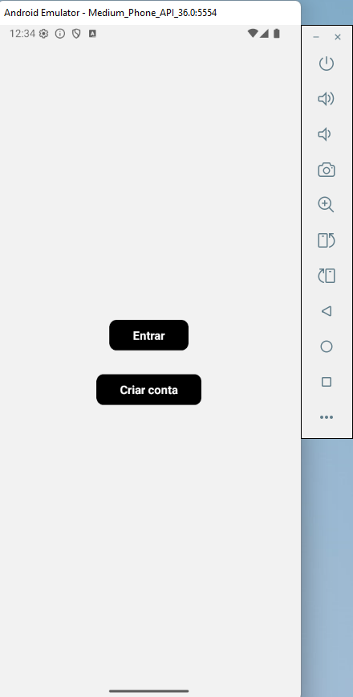
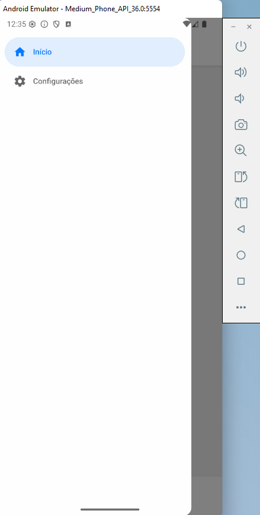
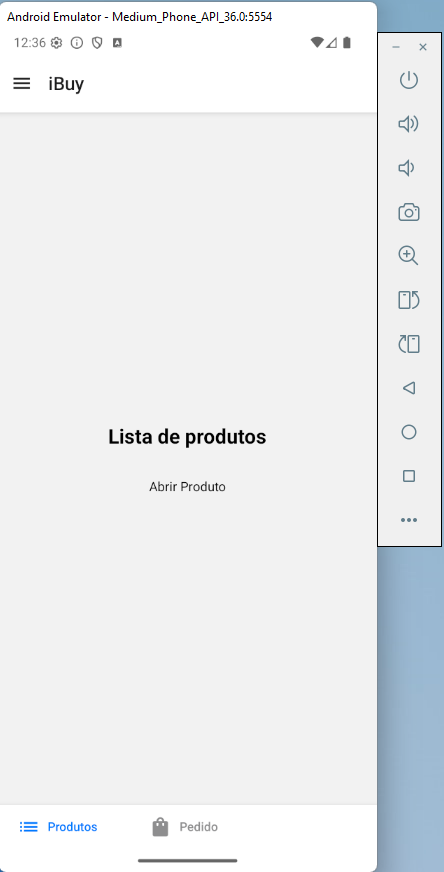
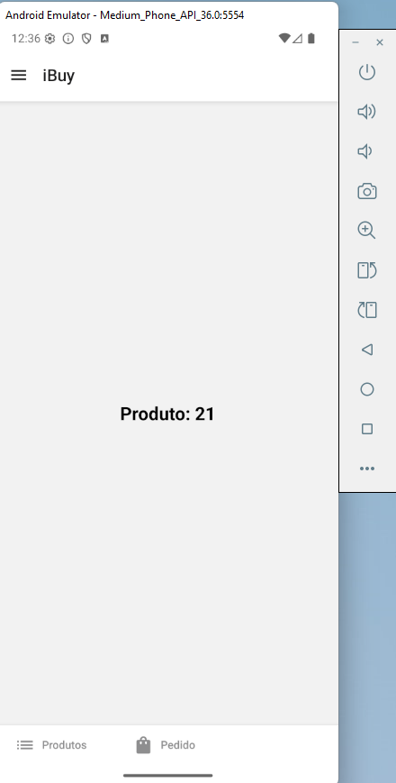

# iBuy

Bem-vindo ao **iBuy**!

Este é um app simples criado para um mini-curso de React Native, com o objetivo de demonstrar conceitos mais avançados do Expo Router, como navegação por Tabs, customização de abas, navegação por Drawer, customização da bandeja e aninhamento de rotas.

## 📱 Sobre o projeto

O iBuy é um exemplo prático de navegação em apps mobile. Ele simula um catálogo de produtos, com telas de início, pedidos e configurações, apenas para fins de aprendizado.

---

## ✨ Funcionalidades

- Navegação por menu lateral (Drawer)
- Navegação por abas (Tabs)
- Customização de abas e bandeja do Drawer
- Telas de início, pedidos e configurações
- Visualização de detalhes de produtos (simulado)
- Aninhamento de rotas

---

## 🛠️ Tecnologias

- React Native
- Expo
- Expo Router
- React Navigation (Drawer & Tabs)
- @expo/vector-icons
- TypeScript

---

## 📸 Screenshots

Adicione aqui prints do app:

| Início | Drawer | Produtos | Detalhe |
|--------|--------|----------|---------|
|  |  |  |  |

## 🚀 Como rodar

2. Clone o projeto:
   ```sh
   git clone https://github.com/marcionavarro/rocketseat-reactnative
   cd react-native/ibuy
   ```
2. Instale as dependências:
   ```sh
   npm install
   ```
3. Inicie o projeto:
   ```sh
   npx expo start
   ```
4. Escaneie o QR code com o app Expo Go ou rode em um emulador.

---

## 📂 Estrutura

```
src/
  app/
    _layout.tsx
    index.tsx
    sign-up.tsx
    (drawer)/
      _layout.tsx
      configs.tsx
      (tabs)/
        _layout.tsx
        index.tsx
        order.tsx
        product/
          _layout.tsx
          [id].tsx
assets/
```

---

## 📝 Licença

Projeto de demonstração para fins educacionais.