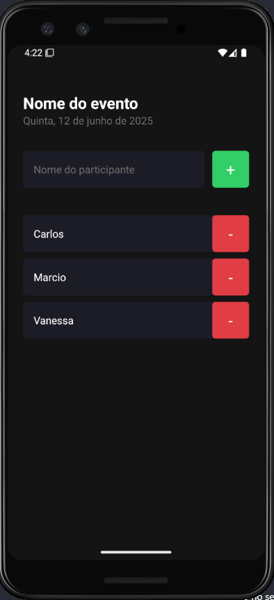
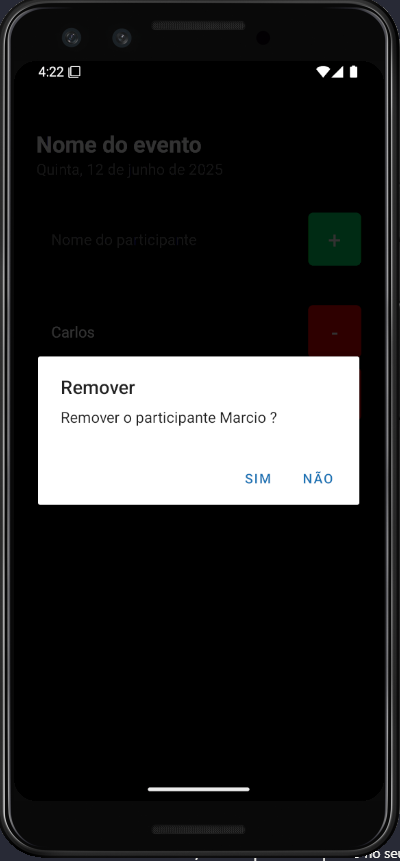

# 📋 imhere


## 📝 Sobre o Projeto

O **imhere** é um aplicativo simples para controle de presença em eventos. Permite adicionar e remover participantes de uma lista, evitando duplicidades e facilitando o gerenciamento de quem já chegou.


## 🚀 Tecnologias Utilizadas

- [Expo](https://expo.dev/)
- [React Native](https://reactnative.dev/)
- [TypeScript](https://www.typescriptlang.org/)


## ✨ Funcionalidades Principais

- ➕ Adicionar participantes à lista
- ➖ Remover participantes com confirmação
- ⚠️ Prevenção de nomes duplicados
- 📋 Visualização dinâmica da lista de presença
- 🕵️ Mensagem amigável quando a lista está vazia


## 🛠️ Instalação

1. **Clone o repositório**
   ```sh
   git clone https://github.com/marcionavarro/rocketseat-reactnative
   cd imhere
   ```

2. **Instale as dependências**
   ```sh
   npm install
   ```

3. **Execute o projeto**
   ```sh
   npx expo start
   ```
   Ou, para rodar diretamente em um emulador Android/iOS:
   ```sh
   npm run android
   npm run ios
   ```


## 📱 Pré-requisitos

- Node.js instalado
- Expo CLI (`npm install -g expo-cli`)
- Emulador Android/iOS ou aplicativo Expo Go no seu dispositivo


## 📸 Screenshots

<div align="center" style="display: flex; width: 33%">
  
  
  
</div>


## 📝 Licença

Este projeto está sob a licença MIT.


<div align="center">
Feito com 💜 por [marcionavarro](https://www.marcionavarro.com.br)
</div>