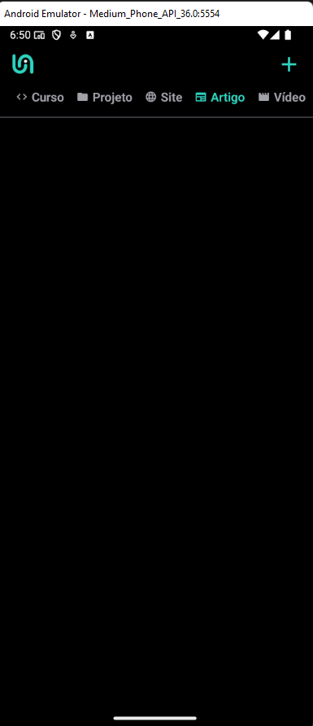
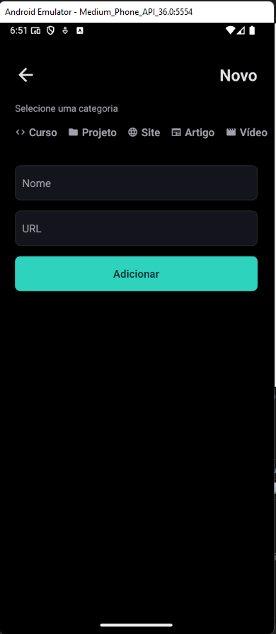
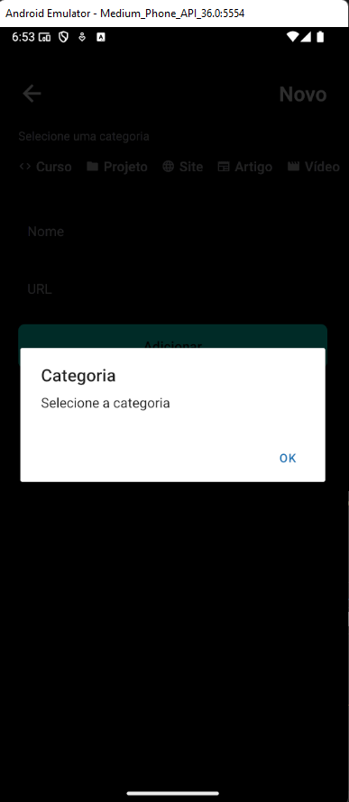
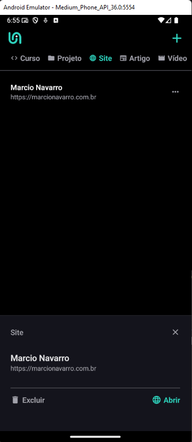
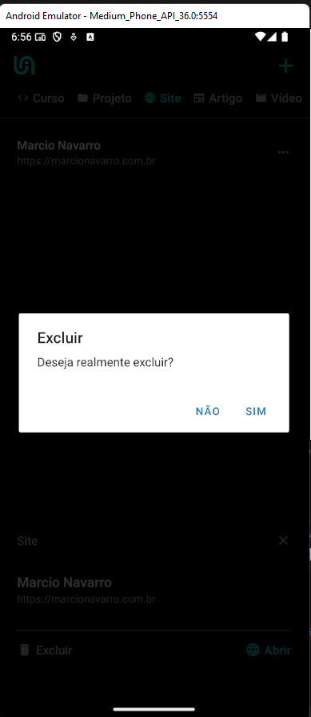

# 🔗 Links

Aplicativo mobile para organização e acesso rápido a links, categorizados de forma simples e intuitiva.

## 🚀 Tecnologias Principais

- 
- 
- 
- 
- **Expo Router**
- **@expo/vector-icons**

## ✨ Funcionalidades

- 📂 Filtrar links por categoria
- ➕ Adicionar novos links
- 🗑️ Remover links
- 🌐 Abrir links diretamente no navegador
- 🖼️ Interface moderna e responsiva
- 💾 Persistência local dos dados


## 📦 Instalação

1. Clone o repositório:
   ```sh
   git clone https://github.com/marcionavarro/rocketseat-reactnative
   cd links
   ```

2. Instale as dependências:
   ```sh
   npm install
   ```

3. Certifique-se de ter um emulador Android/iOS configurado **ou** o aplicativo Expo Go instalado no seu dispositivo físico.

4. Inicie o projeto:
   ```sh
   npx expo start
   ```

5. Siga as instruções do Expo para rodar no emulador ou dispositivo físico.

## 🗂️ Estrutura do Projeto

- `src/app`: Telas principais do app
- `src/components`: Componentes reutilizáveis (categorias, link, opções)
- `src/storage`: Persistência dos links
- `src/styles`: Estilos globais
- `src/utils`: Utilitários e dados estáticos

---


## 🖼️ Screenshots

| Tela Inicial | Adicionar Link | Modal Error |
|--------------|-------------------|---------------|
|  |  |  |

| Detalhes do link | Modal Excluir link
|--------------|-------------------
|  |  |

---
Desenvolvido com 💜 por Marcio Navarro